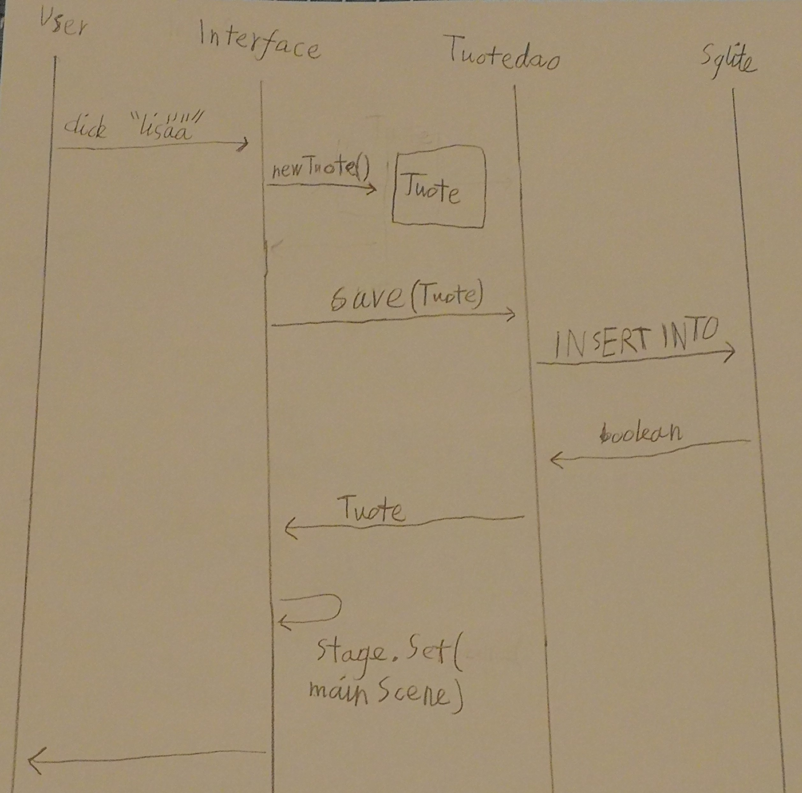
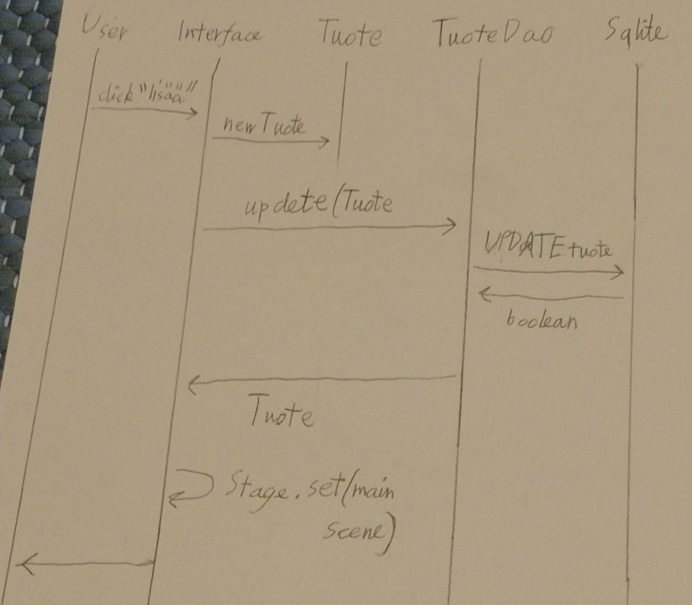
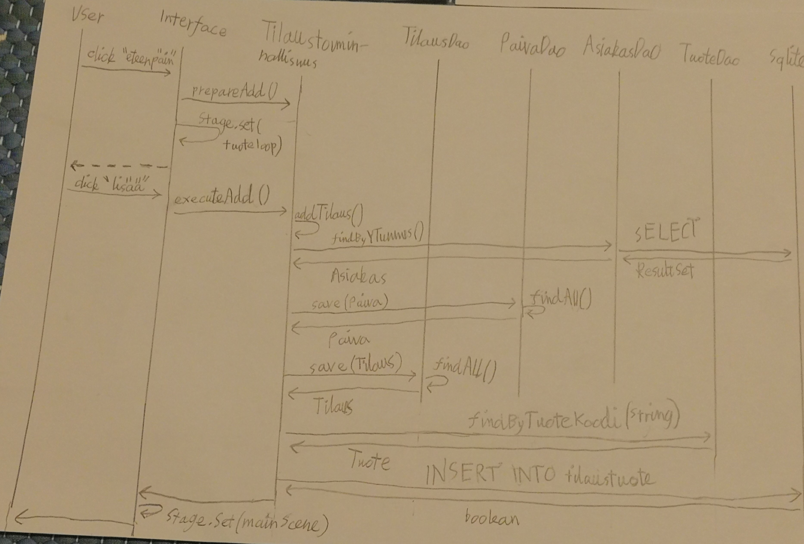

# Arkkitehtuurikuvaus

## Rakenne

Sovelluksen rakenne on kaksi tasoinen, jos mukaan ei oteta varsinaisen ohjelman takana pyörivää tietojenhallintajärjestelmän eli Sqliten toteutusta, missä tieto varsinaisesti tallennetaan tiedostoon, joka sille on alussa määritelty.

Sovelluksen kaksi tasoa ovat käyttöliittymän toteuttavat FXML-tiedostot ja niiden controller-luokat ja Sovelluslogiikassa dao-luokat, jotka vastaavat yksittäisten tietokantatauluun kohdistuvien toimintojen toteuttamisesta. Sekä yksi dao-luokien antamien toimintojen yhdistelmien toteuttamiseen.

## Käyttäliittymä

Sovelluksen käyttöliittymä koostuu 10 näkymästä, joista ensimmäinen sovelluksen käynnistyessä on päänäkymä.

muita näkymiä ovat

* tuotteiden listaus
* tuotteiden lisäys
* tuotteiden muokkaus
* asiakaiden listaus
* asiakaiden lisäys
* tilausten listaus
* tilausten lisäys (kaksi näkymää)
* tilausten muokkaus

Näistä jokainen on toteutettu FXML-tiedoston ja javafx controller-luokan yhdistelmän avulla. Joista jokainen on sovelluksen käynnistyessä tallennettuna erilliseen Scene-olioon ja yksi kerrallaan asetettu näkymään varsinaiseen Stage-olioon.

Sovelluslogiikka on pyritty irroittamaan mahdollisimman suurelta osin käyttöliittymästä luomatta ylimääräisiä luokkia, jotka vain ohjaisivat suoraan eteenpäin tekemättä itse mitään. 

Kun sovelluksen lisäys tai muokkaus toiminnallisuuksia on käytetty, niin käyttäjän täytyy painaa listan uudelleen lataus nappia, jotta muutokset tulee näkyviin. 

## Sovelluslogiikka

Sovelluksen looginen datamalli

Koko luokkakaavio

Molemmat generoitu käyttäen Intellj IDEA Ultimatea

## Tietojen pysyväistallennus

Tiedot tallennetaan paikalliseen tietokantaan käyttäen sqlite-tiedonhallinta jörjestelmää. Tätä yhteyttä varten on luotu Dao-luokat kaikille varsinaisille tietokanta tauluille, jotka toteuttavat kaikki niiden osalta tärkeimmät toiminnot. Joita voidaan sittemmin käyttää, joko monimutkaisemmassa sovellus logiikassa tai suoraan käyttöliittymästä käsin. 

## Tiedostot

Sovelluksen luodessa yhteyttä tietokantaan. Se määrittelee tietokannalle fyysistä tallennusta varten tiedoston nimen.

Sovelluksen juureen sijoitettu [konfiguraatiotiedosto](https://github.com/Jhoneagle/otm-harjoitustyo/blob/master/CompanyCalculator/documentation/kayttoohje.md) [config.properties](https://github.com/Jhoneagle/otm-harjoitustyo/blob/master/CompanyCalculator/config.properties) määrittelee sqlite tietokannan käyttämien tiedostojen nimet.

## Päätoiminnallisuudet

### tuoteen lisäys

Kun käyttäjä on valinnut tuoteen lisäys näkymän ja syöttänyt tuoteelle nimen, tuotekoodin, hinnan ja alvin. Mitkä täyttävät niukan validoinnin ja painaa "lisää" buttonia. Controlleri suorittaa seuraavan sarjan: 

Eli aluksi luodaan saaduista tiedostoista uusi Tuote-olio. Tämän jälkeen se lähetetään TuoteDaon metodille save, jossa sen avulla tehdään lisäys kysely sql tietokantaan eli sqlitelle tässä tapauksessa. Minkä jälkeen metodi palauttaa Tuote olion paluu arvona, kun lisäys on tehty. Lopuksi käyttöliittymä siirtää käyttäjän näkymän takaisin aloitus näkymään. 

### tuoteen muokkaus

Käyttäjän valittua tuote listasta ja painettua "muokkaa". Tulee näkymiin kysely johon voi määritellä uusia arvoja tai jättää tyhjäksi, jos ei halua päivittää. Lopuksi painaa "päivitä" nappia, kunhan validointi on ok, kontrolleri toteutaa seuraavan prosessin: 

Ensiksi siis luodaan Tuote olio tiedoista. Joko uusista tai vanhoista. Tämän jälkeen kutsutaan TuoteDaon udate metodia, jolle parametrina annetaan Tuote olio. metodi tekee päivitys kyselyn tietokantaan ja lopuksi palauttaa Tuote olion, joka on sen jälkeen tietokannassa. Lopuksi käyttöliittymä siirtää näkymän aloitus näkymään. 

### tilauksen lisäys

Käyttäjän avattua tilauksen lisäys näkymän ja annettua asiakaan y-tunnuksen, tilauksen statuksen ja päivämäärän. validointi tarkastuksen mennessä läpi kontrolleri toteuttaa seuraavan prosessin: 

Aluksi saadut kolme arvo laitetaan talteen lisäystä varten, jonka jälkeen siirrytään seuraavaan näkymään (tuoteloopScene), jossa käyttäjä antaa kaikki tilaukseen liittyvät tuottee ja määrät. Tämän valmistuttua ja "lisää" nappia painettua ohjelma jatkaa työtä. Ensiksi kaikki tiedot kasataan, nillä kutsutaan varsinaista lisäys metodia. 

Ensiksi addTilaus metodi etsii AsiakasDaon avulla oikean asiakaan, joka vastaa y-tunnusta. Tämän jälkeen luodaan PaivaDaon avulla uusi paiva tietue ja ne ydistetään Tilaus-oliohon. Mikä tämän jälkeen lisätään TilausDaon avulla tietokantaan.

Lopuksi metodi suorittaa X kertaa loopin, jossa se hakee tuotekoodin perusteella Tuote-olioita TuoteDaon kautta. Minkä jälkeen sen ja tilausDaon save-metodilta saadun Tilaus-oliolla luodaan tarvittava tietue TilausTuote-liitostauluun. Kun se on ohi käyttäjälle annetaan aloitusnäkymä. 

### Muut toiminnallisuudet

Asiakaan lisäys toimii vastaavan laisesti, kuin tuoteen lisäys, mutta eri näkymän ja eri Daon avulla. Taas tilauksen muokkaus vastaa tuoteeen muokkausta, mutta TuoteDaon sijasta on TIlaustoiminnallisuus luokkan metodi. 

Listaukset ja poistot taas tapahtuvat saman kontrolerin kautta ja käyttävät niille varattuja findAll ja delete metodeja. 

## Ohjelman rakenteeseen jääneet heikkoudet

### Käyttöliittymä

Graaffinen käyttöliittymä näkymien vaihto on jäykkä, sill se ei tue kunnolla sovelluksen lisäys ja muokkaus toiminnallisuuksien käyttöä. Tämä johtuu siitä, että sovellus on joko käynnistettävä uudelleen tai käyttäjän on listaus näkymässä painettava listauksen päivittämisnappia, jotta lisäyksen tai muokkauksen vaikutuksen pystyy näkemään.

### Logiikka

Sovelluslogiikka voisi olla erotettu enemmän käyttöliittymästä luomalla erillinen luokka, joka hallinnoi kaiken käyttöliittymän ja logiikan välillä olevan liikenteen. 

Myös logiikan refactorointi helpottuisi, jos testit kattaisivat paremmin luokkien yhteiskäytöön liittyviä tilanteita. 

