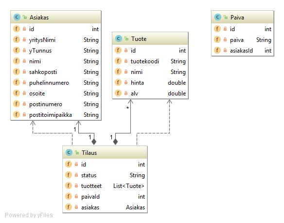

# Arkkitehtuurikuvaus

## Rakenne

## Käyttöliittymä

## Sovellus logiikka

sovelluksen looginen datamalli

koko luokkakaavio

## Tietojen pysyväistallennus

tiedot tallennetaan paikalliseen tietokantaan käyttäen sqlite-tiedonhallinta järjestelmää. Tätä yhteyttä varten on luotu Dao-luokat kaikille varsinaisille tietokanta tauluille, jotka toteuttavat kaikki niiden osalta tärkeimmät toiminnot. Joita voidaan sittemmin käyttää, joko monimutkaisemmassa sovellus logiikassa tai suoraan käyttöliittymästä käsin. 

## Tiedostot

Sovelluksen luodessa yhteyttä tietokantaan. Se määrittelee tietokannalle fyysistä tallennusta varten tiedoston nimen.

Sovelluksen juureen sijoitettu [konfiguraatiotiedosto](https://github.com/Jhoneagle/otm-harjoitustyo/blob/master/CompanyCalculator/documentation/kayttoohje.md) [config.properties](https://github.com/Jhoneagle/otm-harjoitustyo/blob/master/CompanyCalculator/config.properties) määrittelee sqlite tietokannan käyttämien tiedostojen nimet.

## Päätoiminnallisuudet

### muut toiminnallisuudet

## Ohjelman rakenteeseen jääneet heikkoudet

