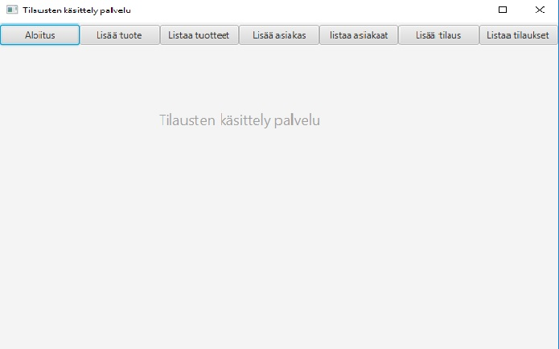
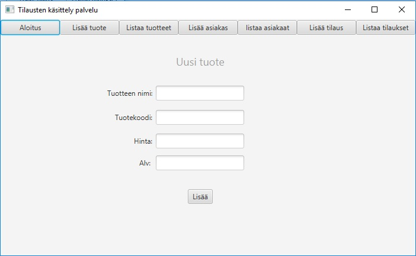
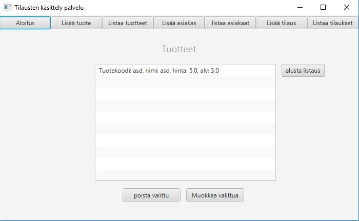
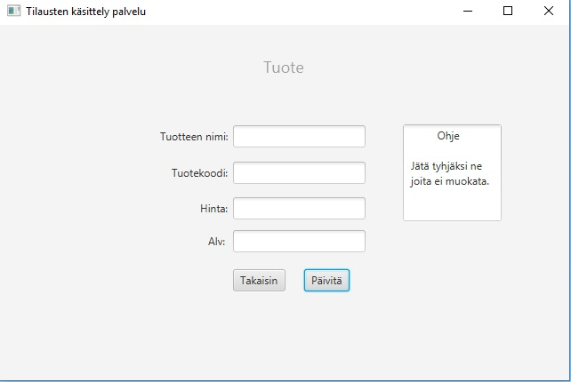
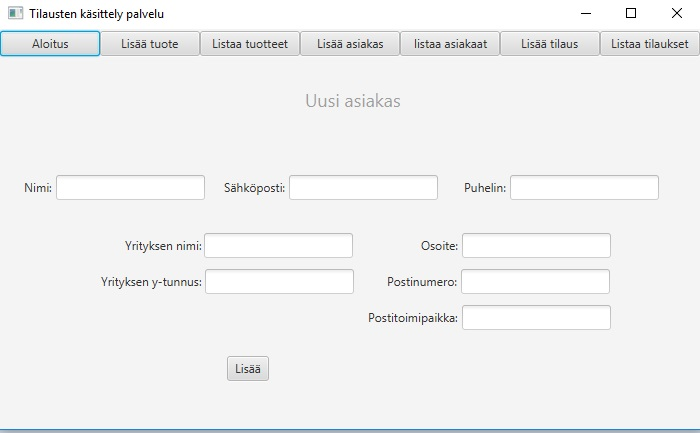
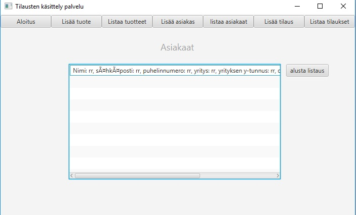
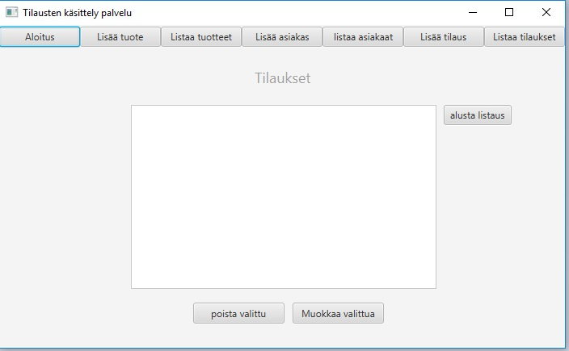
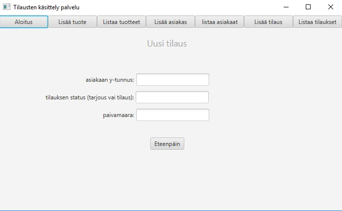
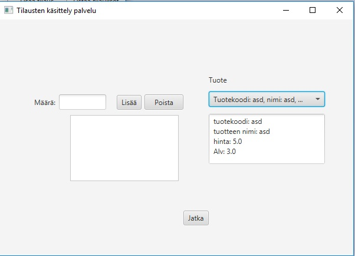

# Käyttöohje

Lataa tiedosto [calculator.jar](https://github.com/Jhoneagle/otm-harjoitustyo/releases/tag/v1.11)

## Konfigurointi

Ohjelma olettaa, että sen käynnistyshakemistossa on konfiguraatiotiedosto _config.properties_, joka määrittelee sqlitelle sen tarvitsemat tietokantojen fyysiseen tallennukseen tarvitsemien tiedostojen nimet. Tiedoston muoto on seuraava

```
mainDatabase=data.db
testDatabaseFile=test.db
```

## Ohjelman käynnistäminen

Ohjelma käynnistetään komennolla 

```
java -jar calculator.jar
```

### Ohjelma käynnistysnäkymä

Sisältää vain navigointi painikeet.



### Tuoteen lisäys



Validoinnit: tuotekoodin täytyy olla uniikki, hinnan pitää olla positiivinen ja alvin pitää olla nollan ja hinnan välillä.

### Tuoteiden listaus



Mahdollisuus poistaa tuoteita ja muokata niitä. Listaus alustettava Buttonista, lisäyksen tai muokkauksen jälkeen.

### Tuoteen muokkaus



Validointi sama, kuin lisäyksessä. Jos ei halua muokata jotakin tietoa, niin kyseinen ruutu pitää jättää tyhjäksi. Jos kohdasta löytyy arvo ohjelma automaattisesti olettaa sen muokkaukseksi.

Mahdollisuus myös palata takaisin.

### Asiakaan lisäys



Validointi: mikään ei saa olla tyhjä ja y-tunnuksen täytyy olla uniikki.

### Asiakaiden listaus



Täytyy päivittää "alusta listaus" napilla sen jälkeen, kun uusi on lisätty

### Tilaus listaus



Mahdollisuus poistaa tilauksia ja muokata niitä. Listaus alustettava Buttonista, lisäyksen tai muokkauksen jälkeen. näyttää kaikki muut tilaukset paitsi ne joiden status on "toimitettu".

### TIlaus muokkaus


Uusi arvo syötetttävä ja jätettävä tyhjäksi, jos ei halua muokata arvoa. Takaisin listaukseen pääsee "takaisin" nappulalla.

### Tilaus lisäys



Validointi: asiakaan y-tunnus oltava olemassa ja muuten vaatimus vain, että jotain. Eteenpäin napilla pääsee seuraavaan vaiheeseen.



Alhaalla olevalla nappulalla toteutetaan lisäys. Avattavasta valikosta voi valita tuotteen tuotevalikoimasta, jolloin tiedot tulevat alle. Tämän lisäksi, jos maara laatikossa on positiivinen luku, niin viereinen lisäys nappi lisää listaukseen tuoteen tuotekoodin ja lukumaaran mitä sitä valitaan. Valintoja voi poistaa "poista" napilla, kun ne on valittuja. 

