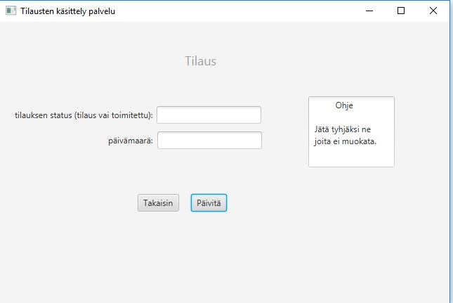

# K‰yttˆohje

Lataa tiedosto [calculator.jar](https://github.com/Jhoneagle/otm-harjoitustyo/releases/tag/v1.11)

## Konfigurointi

Ohjelma olettaa, ett‰ sen k‰ynnistyshakemistossa on konfiguraatiotiedosto _config.properties_, joka m‰‰rittelee sqlitelle sen tarvitsemat tietokantojen fyysiseen tallennukseen tarvitsemien tiedostojen nimet. Tiedoston muoto on seuraava

```
mainDatabase=data.db
testDatabaseFile=test.db
```

## Ohjelman k‰ynnist‰minen

Ohjelma k‰ynnistet‰‰n komennolla 

```
java -jar calculator.jar
```

### Ohjelma k‰ynnistysn‰kym‰

Sis‰lt‰‰ vain navigointi painikeet.


### Tuoteen lis‰ys


Validoinnit: tuotekoodin t‰ytyy olla uiikki, hinnan pit‰‰ olla positiivinen ja alvin pit‰‰ olla nollan ja hinnan v‰lill‰.

### Tuoteiden listaus


Mahdollisuus poistaa tuoteita ja muokata niit‰. Listaus alustettava Buttonista, lis‰yksen tai muokkauksen j‰lkeen.

### Tuoteen muokkaus


Validointi sama, kuin lis‰yksess‰. Jos ei halua muokata jotakin tietoa, niin kyseinen ruutu pit‰‰ j‰tt‰‰ tyhj‰ksi. Jos kohdasta lˆytyy arvo ohjelma automaattisesti olettaa sen muokkaukseksi.

Mahdollisuus myˆs palata takaisin.

### Asiakaan lis‰ys


Validointi: mik‰‰n ei saa olla tyhj‰ ja y-tunnuksen t‰ytyy olla uniikki.

### Asiakaiden listaus


T‰ytyy p‰ivitt‰‰ "alusta listaus" napilla sen j‰lkeen, kun uusi on lis‰tty

### Tilaus listaus


Mahdollisuus poistaa tilauksia ja muokata niit‰. Listaus alustettava Buttonista, lis‰yksen tai muokkauksen j‰lkeen. n‰ytt‰‰ kaikki muut tilaukset paitsi ne joiden status on "toimitettu".

### TIlaus muokkaus



Uusi arvo syˆtettt‰v‰ ja j‰tett‰v‰ tyhj‰ksi, jos ei halua muokata arvoa. Takaisin listauseen p‰‰see "takaisin" nappulalla.

### Tilaus lis‰ys


Validointi: asiakaan y-tunnus oltava olemassa ja muuten vaatimus vain, ett‰ jotain. eteenp‰in napilla p‰‰see seuraavaan vaiheeseen.


Alhaalla olevalla nappulalla toteutetaan lis‰ys. Avattavasta valikosta voi valita tuotteen tuotevalikoimasta, jolloin tiedot tulevat alle. T‰m‰n lis‰ksi, jos maara laatikossa on positiivinen luku, niin viereinen lis‰ys nappi lis‰‰ listaukseen tuoteen tuotekoodin ja lukumaaran mit‰ sit‰ valitaan. vlintoja voi poistaa "poista" napilla, kun ne on valittuja. 

