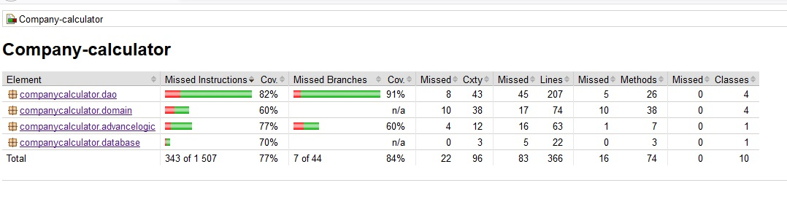

# Testausdokumentti

Sovelluksen järjesstelmätaso on testattu manuaalisesti joten käyttöliittymälle ei ole automaatti testejä. Jotkin testit kuitenkin jossain määrin simuloivat mitä oikea käyttäjä voi tehdä.

Sen sijaan yksikkö- ja integraatiotestausta varten on luotu automaattisia Junittia käyttäviä testejä. 

## Yksikkö- ja integraatiotestaus

Sovelluksen kaikilla Dao-luokilla on tehty yksikkö testit, jotka testaavat tilanteita, joissa oletetaan datan olevan validoitua. Eli eivät testaa tilanteita, joissa saataisiin virheellistä tietoa. 

Integraatio testeissä ja laajemman sovelluslogiikan testeissä kuitenkin käydään myös tilanteita läpi, jossa käyttäjä antaa virheellisiä tietoja. Muutenkin kyseiset testit käyvät läpi kuinka hyvin eri luokat pystyvät toimimaan keskenään ongelmitta. 

### testauskattavuus

Käyttöliittymäkerrosta lukuunottamatta sovelluksen testauksen rivikattavuus on 77% ja haarautumakattavuus 84%.

Suurin osa testaamattomista haarautumista ovat vakavia virhetilanteita kuten nullpointer ja sql kyselyn epäonnistuminen esimerkiksi teitokantataulun puuttuessa. Sen sijaan rivi kattavuudeen poissa oloa selittää tietyjen toimintojen, jota todellisuudessa käytetään puuttumista testeistä. Johtuen niiden tarpeettomuudesta testien näkökulmasta. Monet virhetilanteista mitä testit eivät käsittele on kuitenkin estetty käyttöliittymän validointien kautta.

## Järjestelmätestaus

Sovelluksen järjestelmätestaus on suoritettu manuaalisesti.

### Asennus ja kanfigurointi

Sovellus on haettu ja sitä on testattu [käyttöohjeen](https://github.com/Jhoneagle/otm-harjoitustyo/blob/master/CompanyCalculator/documentation/kayttoohje.md) kuvaamalla tavalla sekä Window- että Linux-ympäristössä siten, että sovelluksen käynnistyshakemistossa on ollut käyttöohjeen kuvauksen mukainen _config.properties_-tiedosto. Sovellusta on myös testattu tapauksessa, jossa tiedostoa ei ole ollut ollenkaan.

### Toiminnallisuudet

Kaikki [määrittelydokumentin](https://github.com/Jhoneagle/otm-harjoitustyo/blob/master/CompanyCalculator/documentation/vaatimusmaarittely.md)  ja käyttöohjeen listaamat toiminnallisuudet on käyty läpi. Kaikkien toiminnallisuuksien yhteydessä on syötekentät yritetty täyttää myös virheellisillä arvoilla kuten tyhjillä ja väärän tyyppisillä arvoilla.

## Sovellukseen jääneet laatuongelmat

Sovellus ei anna tällä hetkellä järkeviä virheilmoituksia, seuraavissa tilanteissa

* Järjestelmä onnistuu löytämään nullpointer virheen (käyttöliittymän validoinneista huolimatta)
* Tietokanta ei vastaa rakenteeltaan oletettua ja antaa virheen
